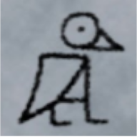

# Operating Systems

## The What

Welcome to my Operating Systems github page! I'm Nadhif Adyatma Prayoga, also known as [eaglescommander](https://github.com/eaglescommander/).
This page is part of my journey through the course OS201.
As simple as it may be I hope someone at least sees this, but not everyone because that would be bad.

## The Who

I usually go by the name Eagles online, but you can call me anything, lately I've been called birdman a lot.

I'm (as of the last update) a student of University of Indonesia, majoring in Computer Science.
To be honest, I don't really want to talk that much about myself. Because someday this might be used against me.
Alas, here I am.

I don't have any particular hobby, but I guess my main kick is consuming media, especially Japanese media.
I do side gigs like translating too.
My interest in computers largely stems from games, I guess my not-so-distant future dream is to work on games or work with games.

## The Why

This page is created to complete the first task that I was given for my finals. While this page only serves as an introduction of me and this site, you might find the other page I created (link down below) more interesting as it contains a few links that will lead you to various resources of what the course entails. Enjoy!

## The How

This page is created using Jekyll, for more information of how I made this, [click here](https://extra182.vlsm.org/step/GitHubPages.html).

## URL Page

[Click here!](https://eaglescommander.github.io/os201/URLs)
